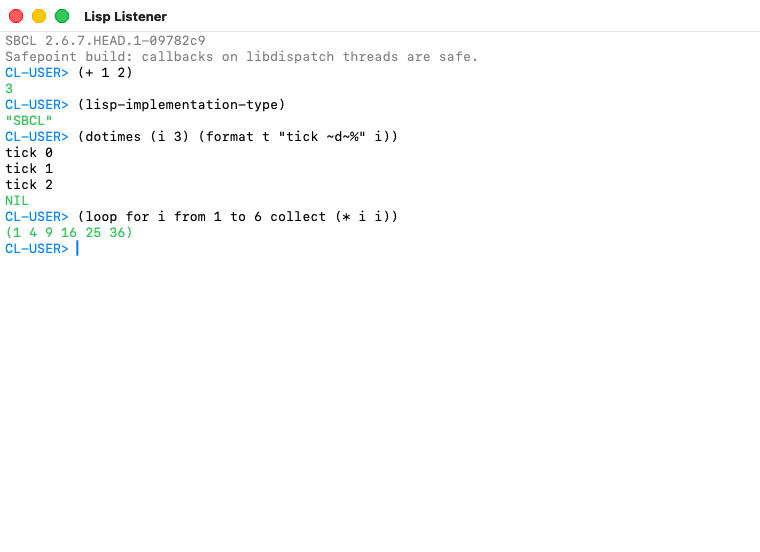
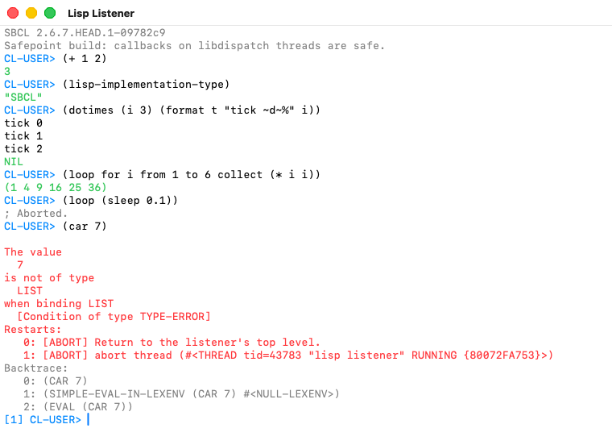
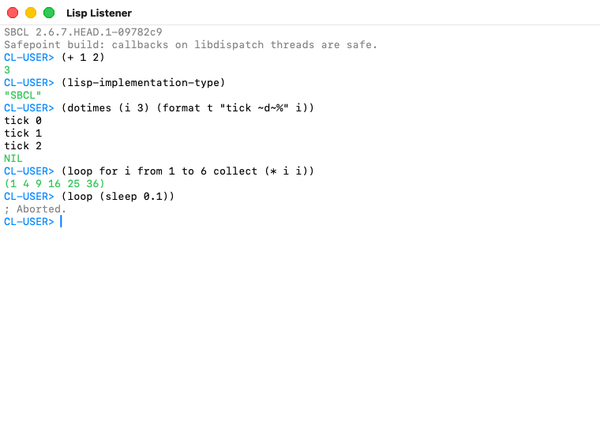

# Lisp Listener

A Lisp Listener in a native Cocoa window, for SBCL on macOS.

Not a REPL in a terminal and not an editor with a REPL pane: a window you type
forms into, with the values, the output and the debugger coming back in the
same transcript — what LispWorks calls a Listener. Every Objective-C class in
it is defined from Lisp, through
[lispnik/objc](https://github.com/lispnik/objc), and it ships as a signed
`.app` built by
[lispnik/asdf-macos-app](https://github.com/lispnik/asdf-macos-app).

```lisp
(asdf:load-system "lisp-listener")
(lisp-listener:run-listener)
```



The debugger prints the condition and a numbered restart list, and the prompt
becomes `[1] CL-USER>`. Type a number to take a restart, or any form to evaluate
it at that level.



Evaluation is on another thread, so a form that never returns leaves the window
responsive, and Interrupt (⌘.) gets the prompt back.



These three are not staged. `src/screenshot.lisp` drives a real listener and
photographs it, and `.github/workflows/macos.yml` runs it on every push — so
they are always a picture of the current code, taken on a GitHub macOS runner.

The capture asks the window's frame view to draw itself into a bitmap, which
is why the title bar is in the picture and why no Screen Recording permission
is involved: nothing is photographed off the screen.

## Requirements

- macOS on arm64 or Intel.
- **An SBCL built `--with-sb-safepoint`.** See below.
- [`objc`](https://github.com/lispnik/objc) and, for the bundle,
  [`asdf-macos-app`](https://github.com/lispnik/asdf-macos-app), on the source
  registry.

## Why a safepoint build

On macOS, a garbage collection that happens while two or more libdispatch
worker threads are inside Lisp kills the process outright:

```
fatal error encountered in SBCL: cannot suspend thread 0x...: 45, Operation not supported
```

No condition, no backtrace, nothing a handler can see. `stop_the_world`
suspends every other thread with `pthread_kill`, and **Darwin refuses to signal
a libdispatch workqueue thread at all** — measured at `ENOTSUP` even for signal
0. Building `--with-sb-safepoint` stops the world by polling instead, and the
problem goes away entirely; the worker is still unsignallable there, which is
the proof that the mechanism rather than the platform changed. lispnik/objc's
[`doc/sbcl-libdispatch-safepoint.md`](https://github.com/lispnik/objc/blob/main/doc/sbcl-libdispatch-safepoint.md)
is the full report, with a self-contained reproducer.

This program uses no GCD of its own. It asks for a safepoint build anyway,
because AppKit reaches libdispatch on its own account and because a listener is
by construction long-lived, hard-consing and multi-threaded — the program most
likely to find that window. It starts on a stock build and says so in the
transcript rather than refusing.

```sh
./make.sh --with-sb-safepoint --prefix=$HOME/.local && sh install.sh
```

If the contrib build dies at `sb-manual`, a source registry containing any ASDF
or UIOP *source* is why — the contrib build calls `upgrade-asdf` and finds it.
Build with `CL_SOURCE_REGISTRY="(:source-registry :ignore-inherited-configuration)"`.

Check a build really has it:

```sh
sbcl --noinform --non-interactive \
     --eval '(print (and (member :sb-safepoint *features*) t))'
```

## Building the application

```sh
make app          # => build/Lisp Listener.app
open "build/Lisp Listener.app"
```

**Run `make app` with the safepoint SBCL itself.** `asdf-macos-app` copies the
runtime of whichever SBCL performs the build into `Contents/MacOS/`, so
building from a stock one pairs a stock runtime with this core and hands back
exactly the fragility the safepoint build exists to remove.

Set `MACOS_SIGNING_IDENTITY` to a Developer ID certificate name to sign for
distribution. Unset, the bundle is signed ad hoc, which runs on the machine
that built it and nowhere else.

### Checking the built app from a shell

```sh
LISP_LISTENER_SELFTEST=/tmp/listener.png \
  "build/Lisp Listener.app/Contents/MacOS/lisp-listener"
```

It evaluates `(+ 1 2)`, waits for the value to appear in the transcript — with
a bound, rather than sleeping and hoping — writes the window to that PNG, and
quits. The result goes to the bundle's log.

## How it works

Two threads, and the split is the whole design.

**Thread 1** owns AppKit and ends up in `-[NSApplication run]`. Every message
to a view, a window or the text storage happens there. **The listener thread**
is an ordinary SBCL thread running read-eval-print; it touches only Lisp state.
So a form that takes a minute, or loops forever, never freezes the window — and
⌘. gets the prompt back.

They meet at two queues. Characters go main → listener, and the listener's
`*standard-input*` blocks on that queue. Closures go listener → main, drained
by an Objective-C method on the view that
`-performSelectorOnMainThread:withObject:waitUntilDone:modes:` delivers.

Because `read` simply blocks on an incomplete form, there is no Lisp parser in
the view: Return always submits, and if the form is not finished no new prompt
appears and you carry on typing. That is what a terminal REPL does, and it
falls out of the design rather than being arranged.

The transcript is one `NSTextView`. The boundary between what you may edit and
what you may not is a single integer, `input-start`; the view is its own
delegate and refuses any change beginning before it. Output arriving from the
listener thread is inserted **at** `input-start` rather than appended at the
end — otherwise a `format` from a computation still running would be spliced
into the middle of the line you are typing.

`*standard-input*`, `*standard-output*`, `*query-io*` and the rest are all
bound to the window, so `(read-line)` in your own code reads from it, and a
restart that needs a value asks for it there.

### The debugger

An error prints the condition and a numbered list of restarts, and the prompt
becomes `[1] CL-USER>`. Type a number to take that restart, or any form to
evaluate it at that level — a debugger level is a working listener. Nesting
works; ⌘. returns to the top.

## Development

```sh
make check          # both of the checks below
make syntax-check   # does it parse?
make compile-check  # does it compile?
```

Both run anywhere, Linux included, and that is the point: this system cannot be
*loaded* off macOS, because lispnik/objc opens libobjc as soon as it
initializes. `syntax-check` reads every form with `*read-suppress*` bound, so
the reader checks structure without consulting a package. `compile-check`
compiles `src/` against `tools/stubs/`, which supplies exactly the names `src/`
uses, so the compiler reports undefined functions, wrong argument counts and
macros that will not expand.

Neither tells you the program works. Only a Mac does that — which is what
`.github/workflows/macos.yml` is for: it builds SBCL `--with-sb-safepoint`,
verifies the build really has them, runs the listener's self-test, builds
`Lisp Listener.app` and runs the bundle's self-test, on both arm64 and Intel.
`.github/workflows/check.yml` runs the two checks above on Linux in seconds.

If you change either checker, break a file on purpose and confirm it goes red —
"no offenders" is also what an empty scan says.

## Known limits

- **`SBCL_HOME`.** A bundle launched from a shell that exports it — Homebrew's
  `sbcl` wrapper does — loads the wrong core and drops into a plain REPL.
  `env -u SBCL_HOME` is the workaround.
- Interrupting with ⌘. a form that is blocked inside a foreign call takes
  effect when the call returns, which is the ordinary SBCL caveat.
- History is per-session and not saved.
- There is no completion, no editor integration and no inspector. It is a
  Listener.

## Licence

MIT.
