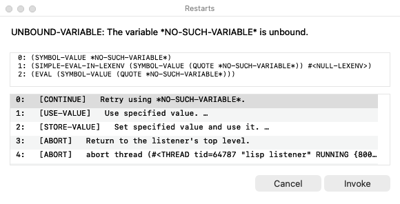

# Lisp Listener

A Lisp Listener in a native Cocoa window, for SBCL on macOS.

Not a REPL in a terminal and not an editor with a REPL pane: a window you type
forms into, with the values, the output and the debugger coming back in the
same transcript — what LispWorks calls a Listener. Every Objective-C class in
it is defined from Lisp, through
[lispnik/objc](https://github.com/lispnik/objc), and it ships as a signed
`.app` built by
[lispnik/asdf-macos-app](https://github.com/lispnik/asdf-macos-app).

```lisp
(asdf:load-system "lisp-listener")
(lisp-listener:run-listener)
```


The debugger prints the condition and a numbered restart list, and the prompt
becomes `[1] CL-USER>`. Type a number to take a restart, or any form to evaluate
it at that level.


A panel of the same restarts opens alongside, after the LispWorks notifier:
the restarts themselves, in the order `compute-restarts` gives them, listed in
an `NSTableView` — so whatever a handler established shows up, rather than a
fixed set of buttons. Select one and press Invoke, or double-click it. Cancel
— and Escape, from the listener window itself — takes the restart that returns
you to the top level, rather than just closing the panel and leaving you at the
`[1]` prompt.



Both the transcript and the panel also carry a **backtrace**, which is the
other half of what the LispWorks Debugger tool shows: the restarts say what you
can do, the frames say where you are. They come from SBCL's own
`sb-debug:list-backtrace` with `:from :debugger-frame` — what SBCL's debugger
itself uses, and what makes the result start at the frame that signalled rather
than at `invoke-debugger` and the hook. The frames below the listener's own
`listener-rep` are cut, since they are the same every time, and
`lisp-listener:*backtrace-frames*` sets the depth.

It is an **addition**. The transcript still prints the list, the prompt still
takes a number, and the panel is not modal — the listener window keeps the
keyboard, so you can type the number with the panel open. Clicking a button
*types that number for you*: a restart has to be invoked on the listener
thread, inside the dynamic extent of the debugger that established it, and
that thread is already sitting in `read-line` waiting for exactly this answer.
So there is one mechanism with two doors, not two mechanisms. Set
`lisp-listener:*restarts-panel-enabled*` to `nil` for the transcript alone.

**New Listener (⌘N)**, in the Listener menu, opens another one. Each window has
its own thread, its own input queue and its own transcript, and they share only
the image they evaluate in — so a form that never returns in one leaves the
others typing, and a window sitting at `[1] CL-USER>` in its debugger leaves the
others at their own top level. Closing a window ends that listener alone; the
application goes when the last one does.

Evaluation is on another thread, so a form that never returns leaves the window
responsive, and Interrupt (⌘.) gets the prompt back.


These three are not staged. `src/screenshot.lisp` drives a real listener and
photographs it, and `.github/workflows/macos.yml` runs it on every push — so
they are always a picture of the current code, taken on a GitHub macOS runner.

The capture asks the window's frame view to draw itself into a bitmap, which
is why the title bar is in the picture and why no Screen Recording permission
is involved: nothing is photographed off the screen.

## Requirements

- macOS on arm64 or Intel.
- **An SBCL built `--with-sb-safepoint`.** See below.
- The Lisp dependencies, which [ocicl](https://github.com/ocicl/ocicl) will
  fetch for you.

## Dependencies, with ocicl

```sh
ocicl setup        # once per machine
make deps          # or: ocicl install
```

That is the whole of it: `ocicl install` reads `ocicl.csv` and restores
everything into `./ocicl/`, which `ocicl setup` has already put on ASDF's
source registry. **No sibling checkouts are needed** —
[`objc`](https://github.com/lispnik/objc) and
[`asdf-macos-app`](https://github.com/lispnik/asdf-macos-app) are themselves
published to ocicl, so a fresh clone plus the two commands above is enough to
`(asdf:load-system "lisp-listener")` and to `make app`.

`ocicl.csv` is a **lockfile**, and it is committed. Every row names its package
by digest:

```
objc, ghcr.io/ocicl/objc@sha256:3a99872f…, objc-20260918-a217b78/objc.asd
```

A digest is the content, not a label that can be re-cut, so `ocicl install`
restores the same 13 packages — 26 system definitions between them — on every
machine and in every CI run. The restored
sources are *not* committed — `/ocicl/` is gitignored — because the lockfile is
what pins them.

If you would rather work against a checkout of `objc` — which is what this
repository's own CI does, so that a break in objc's `master` shows up here
before it is published — put it on `CL_SOURCE_REGISTRY` ahead of `./ocicl/` and
it will shadow the pinned copy.

## Why a safepoint build

On macOS, a garbage collection that happens while two or more libdispatch
worker threads are inside Lisp kills the process outright:

```
fatal error encountered in SBCL: cannot suspend thread 0x...: 45, Operation not supported
```

No condition, no backtrace, nothing a handler can see. `stop_the_world`
suspends every other thread with `pthread_kill`, and **Darwin refuses to signal
a libdispatch workqueue thread at all** — measured at `ENOTSUP` even for signal
0. Building `--with-sb-safepoint` stops the world by polling instead, and the
problem goes away entirely; the worker is still unsignallable there, which is
the proof that the mechanism rather than the platform changed. lispnik/objc's
[`doc/sbcl-libdispatch-safepoint.md`](https://github.com/lispnik/objc/blob/main/doc/sbcl-libdispatch-safepoint.md)
is the full report, with a self-contained reproducer.

This program uses no GCD of its own. It asks for a safepoint build anyway,
because AppKit reaches libdispatch on its own account and because a listener is
by construction long-lived, hard-consing and multi-threaded — the program most
likely to find that window. It starts on a stock build and says so in the
transcript rather than refusing.

```sh
./make.sh --with-sb-safepoint --prefix=$HOME/.local && sh install.sh
```

If the contrib build dies at `sb-manual`, a source registry containing any ASDF
or UIOP *source* is why — the contrib build calls `upgrade-asdf` and finds it.
Build with `CL_SOURCE_REGISTRY="(:source-registry :ignore-inherited-configuration)"`.

Check a build really has it:

```sh
sbcl --noinform --non-interactive \
     --eval '(print (and (member :sb-safepoint *features*) t))'
```

## Building the application

```sh
make app          # => build/Lisp Listener.app
open "build/Lisp Listener.app"
```

**Run `make app` with the safepoint SBCL itself.** `asdf-macos-app` copies the
runtime of whichever SBCL performs the build into `Contents/MacOS/`, so
building from a stock one pairs a stock runtime with this core and hands back
exactly the fragility the safepoint build exists to remove.

Set `MACOS_SIGNING_IDENTITY` to a Developer ID certificate name to sign for
distribution. Unset, the bundle is signed ad hoc, which runs on the machine
that built it and nowhere else.

### Checking the built app from a shell

```sh
LISP_LISTENER_SELFTEST=/tmp/listener.png \
  "build/Lisp Listener.app/Contents/MacOS/lisp-listener"
```

It evaluates `(+ 1 2)`, waits for the value to appear in the transcript — with
a bound, rather than sleeping and hoping — writes the window to that PNG, and
quits. The result goes to the bundle's log.

## How it works

Two threads per listener, and the split is the whole design.

**Thread 1** owns AppKit and ends up in `-[NSApplication run]`. Every message
to a view, a window or the text storage happens there. **The listener thread**
is an ordinary SBCL thread running read-eval-print; it touches only Lisp state.
So a form that takes a minute, or loops forever, never freezes the window — and
⌘. gets the prompt back.

With more than one window open there is one thread 1 and one listener thread
each. `lisp-listener:*listeners*` is the live set; `*listener*` names whichever
one the code running at that moment speaks for, and it is **bound** rather than
assigned — each view's Objective-C methods bind it to the listener whose view it
is, and each listener thread to its own. A menu command instead asks for the key
window's, through `current-listener`, because a menu item's action arrives
saying nothing about which window it came from.

They meet at two queues. Characters go main → listener, and the listener's
`*standard-input*` blocks on that queue. Closures go listener → main, drained
by an Objective-C method on the view that
`-performSelectorOnMainThread:withObject:waitUntilDone:modes:` delivers.

Because `read` simply blocks on an incomplete form, there is no Lisp parser in
the view: Return always submits, and if the form is not finished no new prompt
appears and you carry on typing. That is what a terminal REPL does, and it
falls out of the design rather than being arranged.

The transcript is one `NSTextView`. The boundary between what you may edit and
what you may not is a single integer, `input-start`; the view is its own
delegate and refuses any change beginning before it. Output arriving from the
listener thread is inserted **at** `input-start` rather than appended at the
end — otherwise a `format` from a computation still running would be spliced
into the middle of the line you are typing.

`*standard-input*`, `*standard-output*`, `*query-io*` and the rest are all
bound to the window, so `(read-line)` in your own code reads from it, and a
restart that needs a value asks for it there.

### Restarts that ask

Some restarts do not finish the job when you take them; they start a
conversation. `use-value` and `store-value` carry an *interactive function*,
and SBCL's prints `Enter a form to be evaluated:` and reads one back — on
`*query-io*`, which is this window. So the panel marks them:

```
0:   [CONTINUE]   Retry using *MISSING*.
1:   [USE-VALUE]   Use specified value. …
2:   [STORE-VALUE]   Set specified value and use it. …
3:   [ABORT]   Return to the listener's top level.
```

The ellipsis is the Mac convention for a control that opens a prompt rather
than acting, and it is read from the restart itself, so it appears for anything
a handler established with an `:interactive` clause, not for a fixed list. The
transcript's numbered list is marked the same way — two doors onto one list of
restarts have to agree about it, or typing `1` and clicking row 1 would look
like different acts.

Clicking such a row works exactly as clicking any other: the panel hides, the
number is typed into the window, and the interactive function's question and
your answer go through the transcript. One mechanism, the same two doors.

`y-or-n-p` and `yes-or-no-p` converse in the window for the same reason.

### The debugger

An error prints the condition and a numbered list of restarts, and the prompt
becomes `[1] CL-USER>`. Type a number to take that restart, or any form to
evaluate it at that level — a debugger level is a working listener. Nesting
works; ⌘. returns to the top.

## Development

```sh
make deps           # restore the pinned dependencies into ./ocicl/
make check          # all three of the checks below, in about three seconds
make syntax-check   # does it parse?
make compile-check  # does it compile?
make test           # does the listener work?
```

The three checks need no dependencies at all — they run against
`tools/stubs/`, so `make check` works in a fresh clone before `make deps`.

All three run anywhere, Linux included, and that is the point: this system
cannot be *loaded* off macOS, because lispnik/objc opens libobjc as soon as it
initializes. `syntax-check` reads every form with `*read-suppress*` bound, so
the reader checks structure without consulting a package. `compile-check`
compiles `src/` against `tools/stubs/`, which supplies exactly the names `src/`
uses, so the compiler reports undefined functions, wrong argument counts and
macros that will not expand.

`make test` is the interesting one, because only *half* of this program is
Cocoa. `tools/headless-test.lisp` starts a real listener on those same stubs —
a real thread, the real gray streams, the real reader, evaluator, printer and
debugger — and drives it through a session, an error, `use-value`,
`store-value`, `y-or-n-p` and an abort, reading the transcript back and
asserting on it. The seam that makes it possible is `schedule-flush`, which
declines to do anything while there is no main thread to flush to, so the
output simply piles up in the stream where the test can read it.

It earns its place. The `stream-line-column` method on the *input* stream
exists because this harness found, in seconds, that `fresh-line` on a two-way
stream asks the input half for its column — which had quietly broken every
restart that prompts, and `y-or-n-p` with them, through three rounds of CI
screenshots that all looked fine. Delete that method and three cases go red.

What it does **not** cover is anything with a window in it: the view, the
panel, the table, the screenshots are all stubs here. Only a Mac does that —
which is what `.github/workflows/macos.yml` is for: it builds SBCL
`--with-sb-safepoint`, verifies the build really has them, runs the listener's
self-test, builds `Lisp Listener.app` and runs the bundle's self-test, on both
arm64 and Intel. `.github/workflows/check.yml` runs the three above on Linux in
seconds.

If you change any of the three, break something on purpose and confirm it goes
red — "no offenders" is also what an empty scan says.

## Known limits

- **`SBCL_HOME`.** A bundle launched from a shell that exports it — Homebrew's
  `sbcl` wrapper does — loads the wrong core and drops into a plain REPL.
  `env -u SBCL_HOME` is the workaround.
- Interrupting with ⌘. a form that is blocked inside a foreign call takes
  effect when the call returns, which is the ordinary SBCL caveat.
- History is per-session and not saved.
- There is no completion, no editor integration and no inspector. It is a
  Listener.

## Licence

MIT.
